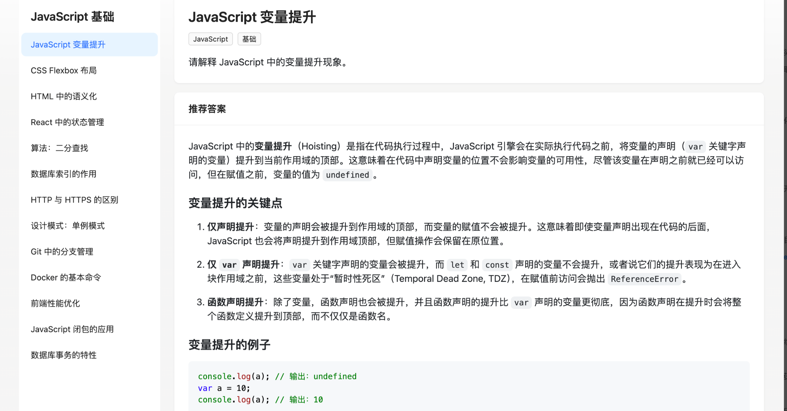
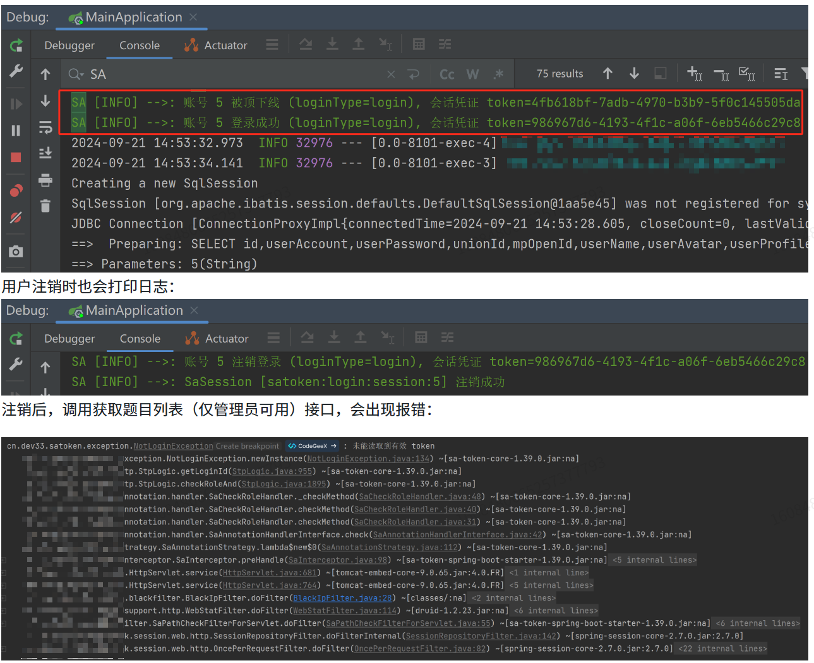

    

<h1 align="center">潘多拉魔盒 - 面试刷题平台</h1>

<strong>
    基于Next.js + Spring Boot + Redis + MySQL + Elasticsearch 构建的面试刷题平台。
     致力于面试刷题，帮助每个人成为八股大师🚀。。
     <em>持续更新中～</em>
</strong>

    
    

## 一、项目介绍🚀

    

基于Next.js + Spring Boot + Redis + MySQL + Elasticsearch 构建的面试刷题平台。
致力于面试刷题、智能解析面试八股文，帮助人们解决和掌握计算机中晦涩难懂的知识点等问题，
旨在为用户提供便捷、高效、安全的刷题体验，
同时为管理员提供全面的题库管理功能。

## 二、架构设计图🎨

    

## 三、技术亮点🔍

1. **性能提升**
    - 运用 Druid 数据库连接池技术，有效管理数据库连接，减少连接创建和销毁的开销，提升系统性能。
    - 结合 JD- HotKey 热 Key 探测技术，及时发现热点数据，优化系统对高频请求的处理。
    - 利用 Redis 缓存技术，缓存常用数据，减少数据库查询次数，加快数据访问速度。
    - 使用高级数据结构，进一步优化数据处理逻辑，提高系统整体性能。
2. **安全保障**
    - 采用 Sa - Token 实现可靠的用户认证和授权机制，确保用户数据安全和操作合法性。
    - 借助 Sentinel 进行流量控制和熔断处理，防止系统因突发大流量而崩溃，保障系统的稳定性和可用性。
    - 通过动态 IP 黑白名单过滤技术，有效阻止恶意 IP 的访问，增强系统的网络安全性。
    - 实现同端登录冲突检测，防止账号在多端异常登录，保护用户账号安全。
    - 运用分级反爬虫策略，抵御恶意爬虫对系统内容的非法获取，确保平台数据的安全性。

## 四、技术选型

### 前端

- React 18 框架
- ⭐️ Next.js 服务端渲染
- ⭐️ Redux 状态管理
- Ant Design 组件库
- 富文本编辑器组件
- ⭐️ 前端工程化：ESLint + Prettier + TypeScript
- ⭐️ OpenAPI 前端代码生成

### 后端

- Java Spring Boot 框架 + Maven 多模块构建
- MySQL 数据库 + MyBatis-Plus 框架 + MyBatis X
- Redis 分布式缓存 + Caffeine 本地缓存
- Redission 分布式锁 + BitMap + BloomFilter
- ⭐️ Elasticsearch 搜索引擎
- ⭐️ Druid 数据库连接池 + 并发编程
- ⭐️ Sa-Token 权限控制
- ⭐️ HotKey 热点探测
- ⭐️ Sentinel 流量控制
- ⭐️ Nacos 配置中心
- ⭐️ 多角度项目优化：性能、安全性、可用性

### 环境搭建

#### 🎉后端环境搭建

后端项目使用 SpringBoot 开发，需要安装 JDK 17 、 MySQL 数据库、Redis、Elasticsearch 。

在项目目录下的`application.yml`修改自己的启动环境`spring.profiles.active` = `dev`
然后找到同级文件`application-dev.properties`，填写自己的环境配置(MySQL、Redis)。

#### 🎉 前端环境搭建

前端项目使用 React 开发，需要安装 Node.js（Node 18 版本，请保持一致） 、npm 。

在项目目录下执行`npm install`安装依赖，然后执行`npm run start`启动项目。

## 五、功能介绍
### 简单介绍（粗略）
1. **管理员功能**
    - **题库管理**：可轻松管理题库，包括创建新库、为不同场景准备题目集合。
    - **题目管理**：能在已有题库中添加多种类型题目。
    - **题目详情**：支持多种类型题目，包括单选、多选、判断、填空、编程等。
    - **题解管理**：为题目添加详细题解，助力用户学习。
2. **用户功能**
    - **注册与登录**：便捷注册登录，开启刷题。
    - **分词检索题目**：借助 Elasticsearch 分词检索快速找题。
    - **在线刷题**：在平台刷题，答题情况被实时记录。
    - **刷题记录查看**：通过日历图查看刷题历程和进度。
3. **安全性**
    - **缓存热点与热 key**：用三级缓存技术处理热点数据和热 key，监测访问频率，优化性能，保障稳定。
    - **限流与熔断**：运用限流与熔断机制，监控和控制流量，过载时防止系统崩溃。
    - **IP 管理**：采用 IP 黑白名单技术，区分可信和恶意 IP，保障网络安全。
    - **同端登录检测**：通过同端登录检测机制，监控账号状态，防止异常登录，保护账号安全。
    - **反爬虫策略**：依据分级反爬虫策略，对访问请求监测，超限制先警告后封号，保护平台。
### 功能展示（详尽）
1. **管理员功能**
    - **题库管理**
      
    - **题目管理**
      
    - **题库详情**
      
    - **题解管理**
2. **用户功能**
    - **注册与登录**
    - **分词检索题目**
      
    - **在线刷题**
      
    - **刷题记录日历图**
      
3. **安全性**
    - **缓存热点与热key**
      
    - **限流与熔断**
      
    - **IP 黑白名单**
      
    - **同端登录冲突检测**
      
    - **分级反爬虫策略**
        - 访问次数超过一定限制，发送邮件
        - 访问次数超过限制太多，封号处理
          

## 六、如何参与

如果您对本项目感兴趣，欢迎通过以下方式参与：

1. **Fork 本项目**：在 GitHub 上 Fork 这个仓库到您自己的账号下。
2. **创建分支**：从您 Fork 的仓库中创建新的分支，用于开发新功能或修复问题。
3. **提交代码**：在本地完成代码开发后，将代码提交到您创建的分支上。
4. **发起 Pull Request**：向本项目的主仓库发起 Pull Request，我们会及时审核您的代码。

希望这个项目能为您带来丰富的学习体验和收获，感谢您的关注和支持！